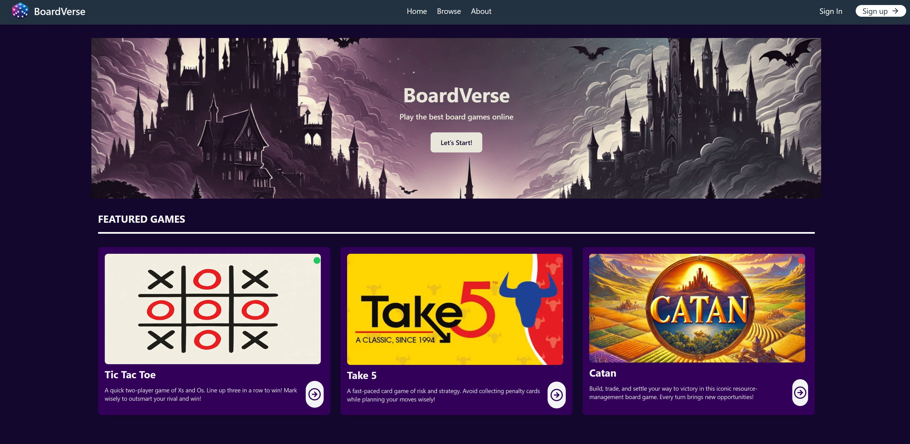

# BoardVerse

A web platform for discovering and playing board games online.

**Live site:** https://boardverse.vercel.app/

---

## Screenshots



---

## Features

- **Game browsing** — Browse featured titles and explore individual game pages with descriptions and availability indicators.
- **Authentication** — Register and log in via JWT-based auth; profile routes are middleware-protected.
- **Player profiles** — View level, rank score, win/loss record, win rate, and recent game activity.
- **Real-time multiplayer** — Create or join Tic-Tac-Toe lobbies and play live with boardgame.io.
- **In-game feedback** — Toast notifications for turns and results; stats update automatically after each match.
- **Responsive UI** — Tailwind CSS + DaisyUI for consistent styling across screen sizes.

---

## Tech Stack

| Layer | Technology |
|-------|------------|
| Framework | Next.js 15 (App Router, React 19 RC) |
| Styling | Tailwind CSS + DaisyUI |
| Multiplayer | boardgame.io 0.50 |
| Auth | JWT via HTTP-only cookie, jwt-decode |
| Validation | Zod |
| Icons / Toasts | Lucide React, React Toastify |

---

## Getting Started

**Prerequisites:** Node.js 18+, a running boardgame.io server (see [Multiplayer Setup](#multiplayer-setup)).

```bash
git clone <repo-url>
cd boardverse-frontend
npm install
npm run dev
# Open http://localhost:3000
```

---

## Multiplayer Setup

The game server is not bundled with this repo. You need a boardgame.io server that registers the `tic-tac-toe` game and exposes:

| Endpoint | Address |
|----------|---------|
| Socket.IO (gameplay) | `ws://localhost:8000` |
| Lobby REST (create / join / list) | `http://localhost:8001/games/tic-tac-toe` |

---

## Project Structure

```
boardverse-frontend/
├── app/
│   ├── (default)/             # Public routes (home, browse, auth, profile)
│   │   ├── _actions/          # Server actions (login, match, profile)
│   │   ├── browse/            # Game listing and per-game pages
│   │   ├── profile/           # Protected user dashboard
│   │   └── api/               # Proxy routes to backend
│   └── (game)/
│       └── tic-tac-toe-game/  # boardgame.io client + board UI
├── components/                # Shared UI (Navbar, GameCard, LobbyScreen…)
└── public/
    └── assets/
        └── images/            # All static images
```

---

## Backend

Auth, profiles, and stats are served by a separate backend deployed on Render.

| Service | URL |
|---------|-----|
| Auth / Profile / Stats | `https://boardverse-backend.onrender.com` |

Login returns a JWT stored as an `access_token` HTTP-only cookie. Profile and stats routes require a valid token — enforced by `app/middleware.jsx`.

---

## Deployment

Deployed on Vercel: https://boardverse.vercel.app/

---

## Notes

- Only Tic-Tac-Toe is currently playable; other game pages are placeholders.
- boardgame.io server endpoints are hard-coded to `localhost` — update before deploying multiplayer to production.
- The project uses React 19 RC and Next.js 15; behavior may shift with upstream releases.
